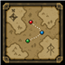

<p align="center">
  
</p>

<h1 align="center">GroupScape</h1>

<p align="center">
  A self-hosted webapp for OSRS groups — clans, group ironmen, and friend groups.
</p>

<p align="center">
  <a href="./LICENSE"></a>
</p>

Source for the paired RuneLite plugin: [groupscape-plugin](../groupscape-plugin)

## What it does

Each group member's plugin streams telemetry to a group-scoped server. This webapp turns that into a live, OSRS-themed dashboard for the group. Currently it tracks:

* Inventory, equipment, bank, rune pouch, and shared bank
* Skill XP
* World position, viewable in an interactive map
* HP, prayer, energy, and world, as well as showing inactivity
* Quest state — completed, finished, in progress

## Layout

- [`server/`](server) — Rust backend
- [`site/`](site) — frontend webapp

## Self-hosting

In the plugin settings, set the URL for the server you're hosting on.

### With Docker

Prerequisites: Docker, docker-compose.

Copy `docker-compose.yml`, `.env.example`, and `schema.sql` (in `server/src/sql`) onto your server. Copy the contents of `.env.example` into a new `.env` file alongside them and fill it with your secrets — the file explains what goes in each one.

`docker-compose.yml` has a line pointing at the `schema.sql` path; update it to match where you placed the file. Then run:

```sh
docker-compose up -d
```

This spins up the frontend and backend together. The backend is available on port 5000 and the frontend on port 4000 by default (both configurable in the compose file).

### Without docker-compose (untested)

Set up the Postgres database and pass secrets in as Docker environment variables, then run the images directly:

```sh
docker run -d -e HOST_URL= groupscape-frontend
```

```sh
docker run -d -e PG_USER= -e PG_PASSWORD= -e PG_HOST= -e PG_PORT= -e PG_DB= -e BACKEND_SECRET= groupscape-backend
```

Once running, the backend is available on port 8080 and the frontend on port 4000.

## Dev setup

```sh
cd server && cargo build
```

```sh
cd site && npm install && npm run dev
```

Verify before reporting a change done: `site/Dockerfile` and `server/Dockerfile` build, `npm test` / `npm run test:e2e` in `site/`, and `cargo test` in `server/`.

## License

[BSD 2-Clause](./LICENSE)
